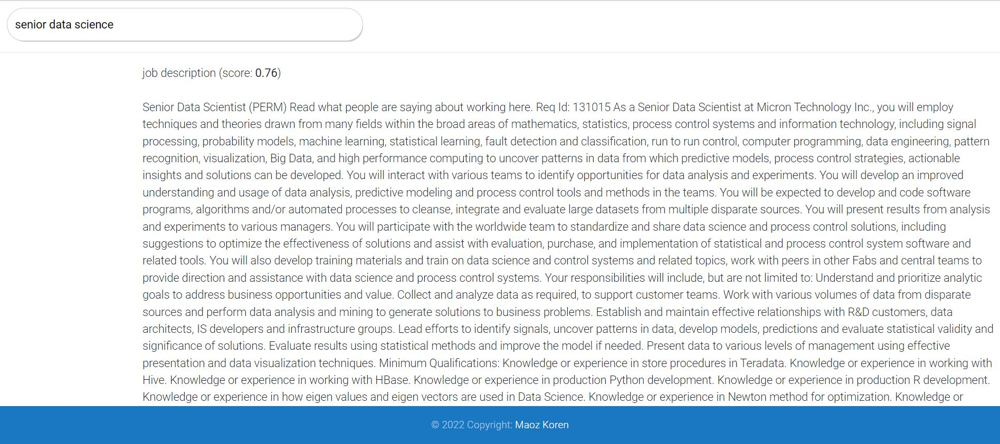

# Next Generation Job Search
NLP project - Search Engine for Data Science jobs using SBERT model.

A prototype implementation for a web based job search engine.

This code finds the most relevant parts of each job description
and lets you search for the most relevant job for you!

### Web search UI:

Just type the job that you are looking for and press Enter,
and the jobs that fit your query the best will appear at the top of the list!



The sample data is taken from [https://www.kaggle.com/code/ranand60/analysis-of-job-posting-data-scientist-in-us/data](https://www.kaggle.com/code/ranand60/analysis-of-job-posting-data-scientist-in-us/data).

### Install requirements 
```
pip install -r requirements.txt
```
### Run Program
In order to run a job search:
```
python app.py
```
### Open UI
Enter link to LOCALHOST:5000: http://127.0.0.1:5000
